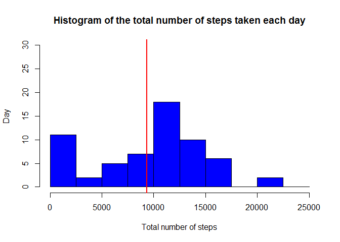

# Reproducible Research: Peer Assessment 1
setwd("C:/Users/RamirezK/RepData_PeerAssessment1")

## Loading and preprocessing the data


```r
library(lubridate)
library(ggplot2)
```

```
## Warning: package 'ggplot2' was built under R version 3.2.3
```

```r
library(scales)
library(base)
library(dplyr)
```

```
## 
## Attaching package: 'dplyr'
## 
## The following objects are masked from 'package:lubridate':
## 
##     intersect, setdiff, union
## 
## The following objects are masked from 'package:stats':
## 
##     filter, lag
## 
## The following objects are masked from 'package:base':
## 
##     intersect, setdiff, setequal, union
```

```r
activity<-read.csv("activity.csv")
activity$date <- as.Date(activity$date)
```


## What is mean total number of steps taken per day?

```r
ByDay <- aggregate(activity$steps, by=list(activity$date), FUN=sum, na.rm=TRUE)

colnames(ByDay)<-c("date","steps")

hist(ByDay$steps, 
     breaks=seq(from=0, to=25000, by=2500),
     col="Blue", 
     xlab="Total number of steps",
     ylab="Day",
     ylim=c(0, 30), 
     main="Histogram of the total number of steps taken each day")
     abline(v=mean(ByDay$steps, na.rm=TRUE), col="red", lwd=2)
```

 

```r
# Calculate mean and median of daily steps
paste("Mean Steps per Day =", mean(ByDay$steps))
```

```
## [1] "Mean Steps per Day = 9354.22950819672"
```

```r
paste("Median Steps per Day =", median(ByDay$steps))
```

```
## [1] "Median Steps per Day = 10395"
```


## What is the average daily activity pattern?

```r
ByInterv <- aggregate(activity$steps, by=list(activity$interval), FUN=sum, na.rm=TRUE)
colnames(ByInterv)<-c("interval","steps")

plot(ByInterv$interval, ByInterv$steps, 
     type="l", 
     main="Frequency of Steps Taken at Each Interval",
     xlab="Interval [minutes]",
     ylab="Average number of Steps",
     col="orange",
     lwd=2)
     abline(h=mean(ByInterv$steps, na.rm=TRUE), col="red", lwd=2)
```

 

## Imputing missing values
###1.Calculate and report the total number of missing values in the dataset


```r
sum(is.na(activity$steps))
```

```
## [1] 2304
```

###2.Filling in all of the missing values in the dataset


```r
####Create a new dataset that is equal to the original dataset but with the missing data filled in
ImputedData <- activity

ImputedData$steps[is.na(ImputedData$steps)] <- 
    tapply(ImputedData$steps, ImputedData$interval, mean, na.rm = TRUE)
```


```r
#compare the two
summary(activity)
```

```
##      steps             date               interval     
##  Min.   :  0.00   Min.   :2012-10-01   Min.   :   0.0  
##  1st Qu.:  0.00   1st Qu.:2012-10-16   1st Qu.: 588.8  
##  Median :  0.00   Median :2012-10-31   Median :1177.5  
##  Mean   : 37.38   Mean   :2012-10-31   Mean   :1177.5  
##  3rd Qu.: 12.00   3rd Qu.:2012-11-15   3rd Qu.:1766.2  
##  Max.   :806.00   Max.   :2012-11-30   Max.   :2355.0  
##  NA's   :2304
```

```r
summary(ImputedData)
```

```
##      steps             date               interval     
##  Min.   :  0.00   Min.   :2012-10-01   Min.   :   0.0  
##  1st Qu.:  0.00   1st Qu.:2012-10-16   1st Qu.: 588.8  
##  Median :  0.00   Median :2012-10-31   Median :1177.5  
##  Mean   : 37.38   Mean   :2012-10-31   Mean   :1177.5  
##  3rd Qu.: 27.00   3rd Qu.:2012-11-15   3rd Qu.:1766.2  
##  Max.   :806.00   Max.   :2012-11-30   Max.   :2355.0
```

```r
##Make a histogram of the total number of steps taken each day and Calculate and report the mean and median total number of steps taken per day

ByDayImputed  <- aggregate(ImputedData$steps, by=list(ImputedData$date), FUN=sum, na.rm=TRUE)

colnames(ByDayImputed)<-c("date","steps")


hist(ByDayImputed$steps, 
     breaks=seq(from=0, to=25000, by=2500),
     col="Blue", 
     xlab="Total number of steps",
     ylab="Day",
     ylim=c(0, 30), 
     main="Histogram of the total number of steps taken each day\n(NA replaced by mean value)")
     abline(v=mean(ByDay$steps, na.rm=TRUE), col="red", lwd=2)     
```

 

```r
# Calculate mean and median of daily steps
paste("Mean Steps per Day (Imputed) =", mean(ByDayImputed$steps))
```

```
## [1] "Mean Steps per Day (Imputed) = 10766.1886792453"
```

```r
paste("Median Steps per Day (Imputed)=", median(ByDayImputed$steps))          
```

```
## [1] "Median Steps per Day (Imputed)= 10766.1886792453"
```


## Are there differences in activity patterns between weekdays and weekends?


```r
#Create a copy of Imputed Data
WeekData<-ImputedData

#weekdays() variable

WeekData$weekdays <- factor(format(weekdays(WeekData$date)))
levels(WeekData$weekdays) <- list(weekday = c("lunes    ", "martes   ",
                                             "miércoles", 
                                             "jueves   ", "viernes  "),
                                 weekend = c("sábado   ", "domingo  "))
#Group Interval
interval_full <- WeekData %>%
  group_by(interval, weekdays) %>%
  summarise(steps = mean(steps))


#Time series plot
ggplot(interval_full, aes(x=interval, y=steps, color = weekdays)) +
  geom_line() +
  facet_wrap(~weekdays, ncol = 1, nrow=2)
```

 


